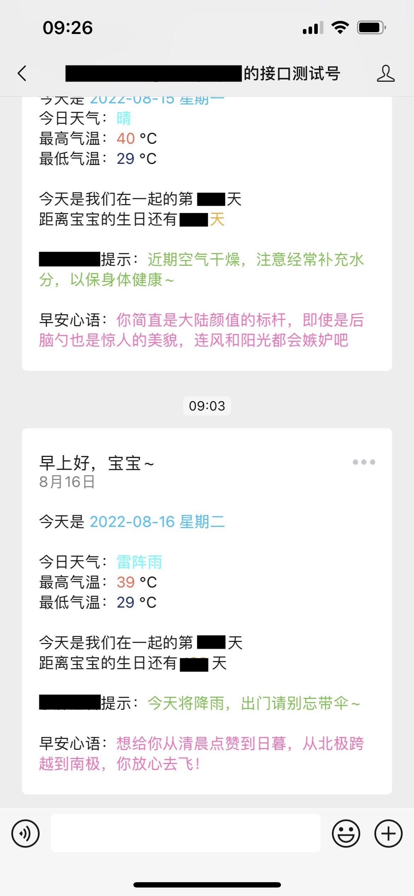

## 微信公众号模板消息推送后端nodejs服务

> 技术栈

- express
- node-schedule
- pm2

### 对接公众号

```javascript
/**
 * 默认的接口进行微信公众号验证
 * @param event
 * @param req
 * @param res
 * @returns {Promise<void>}
 */
async function authVerityApi(event, req, res) {
  const token = config.token; //获取配置的token
  const signature = req.query.signature; //获取微信发送请求参数signature
  const nonce = req.query.nonce; //获取微信发送请求参数nonce
  const timestamp = req.query.timestamp; //获取微信发送请求参数timestamp

  const str = [token, timestamp, nonce].sort().join(""); //排序token、timestamp、nonce后转换为组合字符串
  const sha = sha1(str); //加密组合字符串

  //如果加密组合结果等于微信的请求参数signature，验证通过
  if (sha === signature) {
    const { echostr } = req.query; //获取微信请求参数echostr
    res.send(echostr + ""); //正常返回请求参数echostr
  } else {
    res.send("验证失败");
  }
}

/**
 * 获取微信的token进行验证
 * @returns {Promise<*>}
 */
async function getToken() {
  const params = {
    grant_type: config.grant_type,
    appid: config.appid,
    secret: config.secret,
  };
  let { data } = await axiosGet(
    "https://api.weixin.qq.com/cgi-bin/token",
    params
  );
  return data.access_token;
}
```

### 定时推送

```javascript
const schedule = require("node-schedule");
const { pusher } = require("./service/authService");

// 启动任务
const job = schedule.scheduleJob("0 35 7 * * *", async () => {
  console.log("========定时任务启动======", new Date());
  await pusher();
});
```

### 部署

> 将代码部署到服务器后，开放对应的端口，也可以用```nginx```代理到服务器的80端口
> ```服务器必须有域名```

### PM2启动服务

```bash
pm2 start ./src/main.js -n node-express
```


### 示例

